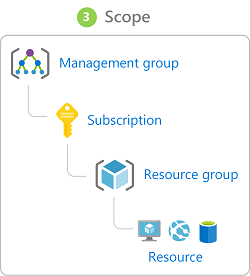
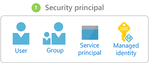
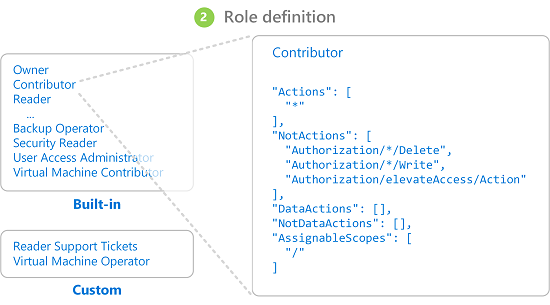
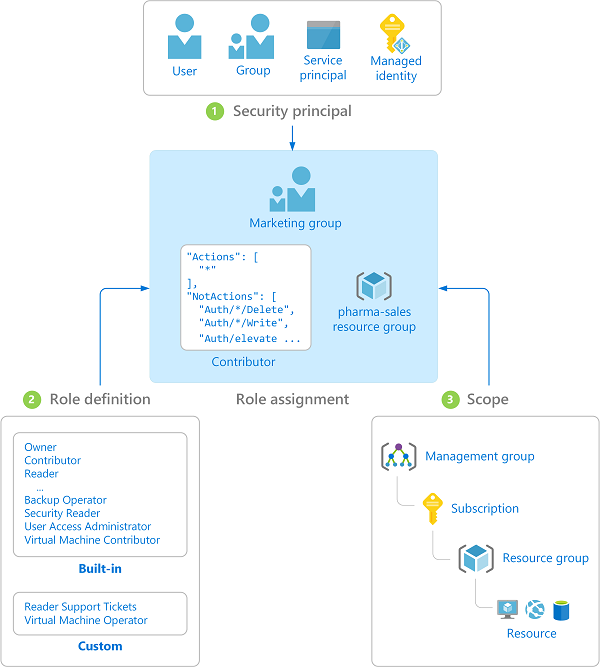

:toc:
:toclevels: 4

= RBAC Simulator 2000

This document is an attempt to document an RBAC data model using the Azure Resource Manager as a reference.

== References

https://docs.microsoft.com/en-us/azure/azure-resource-manager/resource-group-overview[Azure Resource Manager overview]

https://docs.microsoft.com/en-us/azure/azure-resource-manager/[Azure Resource Manager documentation]

https://docs.microsoft.com/en-us/azure/role-based-access-control/overview[What is role-based access control (RBAC) for Azure resources?]

https://docs.microsoft.com/en-us/azure/role-based-access-control/role-definitions[Understand role definitions for Azure resources]

https://docs.microsoft.com/en-us/azure/role-based-access-control/role-assignments-list-powershell[List role assignments using Azure RBAC and Azure PowerShell]

https://docs.microsoft.com/en-us/azure/role-based-access-control/custom-roles-powershell[Create or update custom roles for Azure resources using Azure PowerShell]

https://docs.microsoft.com/en-us/azure/role-based-access-control/resource-provider-operations[Azure Resource Manager resource provider operations]

== Definitions

This section defines RBAC terminology based on the Azure Resource Manager model.

=== Resource

A resource is a manageable item such as a virtual machine, physical machine, storage account, web application or database. Resources can be anything that you wish to restrict access to.

=== Resource Group

A container that holds related resources. The resource group includes those resources that you want to manage as a group depending on what makes the most sense for your organization. A resource can only exist in one resource group at a time.

There are some important factors to consider when defining your resource group:

* All the resources in your group should share the same lifecycle. You deploy, update, and delete them together. If one resource, such as a database server, needs to exist on a different deployment cycle it should be in another resource group.
* Each resource can only exist in one resource group.
* You can add or remove a resource to a resource group at any time.
* You can move a resource from one resource group to another group. For more information, see Move resources to new resource group or subscription.
* A resource group can contain resources that are located in different regions.
* A resource group can be used to scope access control for administrative actions.
* A resource can interact with resources in other resource groups. This interaction is common when the two resources are related but don't share the same lifecycle (for example, web apps connecting to a database).

=== Scope

Azure provides four levels of scope:

. Management Groups
. Subscriptions
. Resource Groups
. Resources

Scopes are structured in a parent-child relationship.

When you grant access at a parent scope, those permissions are inherited to the child scopes. For example:

* If you assign the Owner role to a user at the management group scope, that user can manage everything in all subscriptions in the management group.
* If you assign the Reader role to a group at the subscription scope, the members of that group can view every resource group and resource in the subscription.
* If you assign the Contributor role to an application at the resource group scope, it can manage resources of all types in that resource group, but not other resource groups in the subscription.

=== Security Principal

A security principal is an object that represents a user, group, service principal, or managed identity that is requesting access to resources.

* User - An individual who has a profile in Azure Active Directory. You can also assign roles to users in other tenants.
* Group - A set of users created in Azure Active Directory. When you assign a role to a group, all users within that group have that role.
* Service principal - A security identity used by applications or services to access specific Azure resources. You can think of it as a user identity (username and password or certificate) for an application.
* Managed identity - An identity in Azure Active Directory that is automatically managed by Azure. You typically use managed identities when developing cloud applications to manage the credentials for authenticating to Azure services.

=== Role Definition

A _role definition_ is a collection of permissions. It's typically just called a role. A role definition lists the operations that can be performed, such as read, write, and delete. Roles can be high-level, like owner, or specific, like virtual machine reader.

Azure includes several built-in roles that you can use. The following lists four fundamental built-in roles. The first three apply to all resource types.

* Owner - Has full access to all resources including the right to delegate access to others.
* Contributor - Can create and manage all types of Azure resources but can’t grant access to others.
* Reader - Can view existing Azure resources.
* User Access Administrator - Lets you manage user access to Azure resources.

The rest of the built-in roles allow management of specific Azure resources. For example, the Virtual Machine Contributor role allows a user to create and manage virtual machines. If the built-in roles don't meet the specific needs of your organization, you can create your own custom roles for Azure resources.

Azure has data operations that enable you to grant access to data within an object. For example, if a user has read data access to a storage account, then they can read the blobs or messages within that storage account. For more information, see Understand role definitions for Azure resources.

=== Role Assignment

A role assignment is the process of attaching a role definition to a user, group, service principal, or managed identity at a particular scope for the purpose of granting access. Access is granted by creating a role assignment, and access is revoked by removing a role assignment.

== Fictional Scenario

Let's put RBAC in pratice with a real-world fake company, with https://namey.muffinlabs.com[fake employees] and https://en.wikipedia.org/wiki/Fake_Plastic_Trees[fake plastic trees].

YOLO Consulting is a development company specialized in high-risk operations, such as adding 10 developers to a project at the last minute to ship it 10 times faster. Let's just say that David Ford, the YOLO Consulting CEO, didn't have https://en.wikipedia.org/wiki/The_Mythical_Man-Month[The Mythical Man-Month] in his book shelf.

CEO:

* David Ford <dford@yolo.consulting>

CFO:

* Robert Young <ryoung@yolo.consulting>

CTO:

* Barbara Owens <bowens@yolo.consulting>

Sales:

* Laura Griffin <lgriffin@yolo.consulting>
* John Evans <jevans@yolo.consulting>
* Kimberly Clark <kclark@yolo.consulting>
* Richard Wallace <rwallace@yolo.consulting>
* Jessica Johnson <jjohnson@yolo.consulting>

Support:

* Kimberly Foster <kfoster@yolo.consulting>
* Donna Collins <dcollins@yolo.consulting>
* Sharon Miller <smiller@yolo.consulting>
* Barbara Ford <bford@yolo.consulting>
* Michael Morgan <mmorgan@yolo.consulting>

DevOps:

* Ruth Woods <rwoods@yolo.consulting>
* Sandra Cole <scole@yolo.consulting>
* Karen Hall <khall@yolo.consulting>
* Barbara Murphy <bmurphy@yolo.consulting>
* Robert Watson <rwatson@yolo.consulting>

Web Development:

* John Perry <jperry@yolo.consulting>
* Linda Diaz <ldiaz@yolo.consulting>
* Richard Cook <rcook@yolo.consulting>
* Maria Cole <mcole@yolo.consulting>
* Dorothy Cooper <dcooper@@yolo.consulting>

Rust Development:

* Laura Thompson <lthompson@yolo.consulting>
* Elizabeth Flores <eflores@yolo.consulting>
* William Nelson <wnelson@yolo.consulting>
* John Phillips <jphillips@yolo.consulting>
* Michael Henderson <mhenderson@yolo.consulting>
